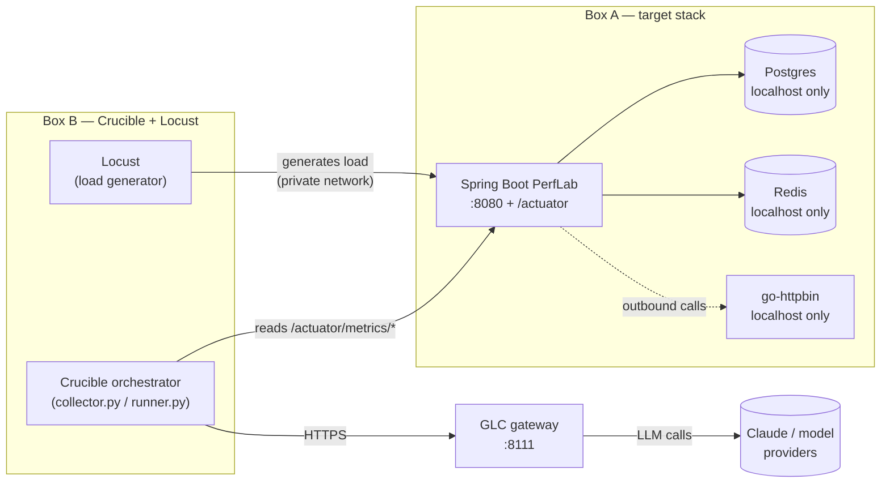

# Cloud provisioning — week 1, items 2 and 3

**Status: COMPLETE, 12 September 2026.** Both boxes provisioned on Oracle
(Ashburn), the target stack is running on Box A, Box B reaches it on `:8080`,
and K1 has been re-run and passed — see §10 and `docs/K1_CLOUD_RESULT.md`.

§4.3, §7 and §10 have been rewritten to record what was actually executed
rather than what was planned; where the original guess was wrong, the wrong
version is called out rather than quietly replaced, because the wrong turns are
the part worth keeping.

This document is written to be executed in its own chat. The prompt to start
that chat is at the bottom.

---

## 1 · Why two boxes, not one

This is a measurement-integrity requirement, not a convenience.

If Locust runs on the same box as the target, the load generator competes with
the JVM for CPU. The p99 you measure is then partly about the load generator,
and every experiment-to-experiment comparison inherits that noise. `DESIGN.md`
§6 makes this explicit: the watchdog carries a **host contention tripwire** that
aborts a run when CPU steal exceeds 5%, because *"better to declare the
measurement invalid than report a p99 that was about someone else's workload"*.
Co-locating the load generator guarantees that condition instead of detecting
it.

So: **target on box A, Crucible + Locust on box B.**

| | Box A — target stack | Box B — Crucible + Locust |
|---|---|---|
| Purpose | the service under test | the agent and the load generator |
| Containers | Spring Boot ~800 MB, Postgres ~256 MB, Redis ~64 MB, Prometheus ~256 MB, Jaeger ~256 MB, httpbin ~64 MB | — |
| RAM needed | ~1.7 GB + headroom → **4 GB comfortable** | ~1 GB → **2 GB comfortable** |
| Notes | week 1 only needs Postgres, Redis, httpbin (see §7's `perf-lab/docker-compose.yml`); Prometheus and Jaeger arrive weeks 2–3 | needs outbound HTTPS to the model gateway |

`DESIGN.md` §16 sizes this as Oracle's free allowance split across two VMs, or a
single Hetzner CX32.

### Diagram — how the two boxes talk to each other



Everything inside Box A talks over `localhost` and is never exposed publicly
(see §8's port table). Only Box B is allowed to reach Box A's `:8080`, and only
over the private network.

---

## 2 · Architecture note — ARM vs x86 (read this before choosing a path)

This matters because the two paths below don't just differ in price — they run
on different CPU architectures, and that's a real (if narrow) engineering
decision, not just a hosting detail.

- **Oracle's Ampere A1 shape is ARM64 (`aarch64`).** Hetzner's CX-series is
  x86-64 (`amd64`, Intel/AMD). Whatever runs in a Docker container on Box A has
  to have a build for whichever architecture you land on.
- **The good news: almost nothing here needs to change.** Postgres, Redis, and
  OpenJDK 21 all ship proper multi-arch images/packages — `apt` and `docker
  pull` will silently pick the right one. None of your application code
  (`collector.py`, `runner.py`, `TargetProfile`, the Spring Boot app itself)
  does anything architecture-specific — this is purely a *Docker image
  selection* concern, confined to Box A.
- **The one thing that does need to change:** `kennethreitz/httpbin`, the
  classic image, **has no arm64 build** — it's a known, long-standing gap (the
  project itself never added multi-arch support). If you land on Oracle and
  pull it anyway, it either fails outright or runs under slow QEMU emulation,
  which quietly reintroduces the exact "noisy neighbour" problem §1 is trying
  to eliminate. The docker-compose.yml in §7 below uses
  **`mccutchen/go-httpbin`** instead — a drop-in, actively maintained
  reimplementation that publishes real multi-arch images (amd64 **and**
  arm64) and serves the same endpoints (`/delay`, `/status`, `/anything`,
  etc.).
- **Already checked and fine for later weeks:** `prom/prometheus` and
  `jaegertracing/all-in-one` both publish arm64 manifests, so the week 2–3
  additions in §7 won't hit this problem. Still worth a 10-second check for
  any *new* image before you pull it on Box A:
  `docker manifest inspect <image>:<tag> | grep -i arch` — if `arm64` isn't
  listed and you're on Oracle, find an alternative before building on top of it.
- **Measurement-portability caveat, not a blocker:** `DESIGN.md` §16 already
  requires re-running K1 on the cloud box *because* shared vCPU is noisier
  than the MacBook — that's true regardless of architecture. But ARM and x86
  JVMs don't have identical JIT/GC timing, so if Box A and Box B ever end up on
  *different* architectures (e.g. target on Oracle ARM, Crucible+Locust
  somewhere x86), treat that as a variable you introduced, not a free
  simplification. Simplest rule: **keep both boxes on the same provider and
  architecture.**
- **CI implication, only if it comes up later:** if you ever build the
  target's Docker image on GitHub Actions (x86 runners by default) and expect
  to run it on an Oracle ARM box, that needs a multi-arch build
  (`docker buildx build --platform linux/amd64,linux/arm64 ...`) or the image
  has to be built directly on the box. For a 4-week capstone, building
  directly on the box is the simpler call — don't add a multi-arch CI pipeline
  unless something forces it.

---

## 3 · Storage — will we have enough?

Short answer: **yes, comfortably, on either path** — this was worth checking
rather than assuming, so here's the actual arithmetic.

| Item | Approx. size |
|---|---|
| Ubuntu 22.04/24.04 base OS | ~3–4 GB |
| Docker Engine itself | ~1 GB |
| Postgres image | ~130 MB (+ data, grows slowly) |
| Redis image | ~40 MB |
| go-httpbin image | ~10 MB |
| Prometheus image (week 2–3) | ~250 MB (+ TSDB data, grows with retention) |
| Jaeger all-in-one image (week 2–3) | ~200 MB |
| Spring Boot target JAR + JDK 21 | ~400–600 MB |
| `crucible` repo clone | well under 200 MB |
| Swap file (§6) | 2 GB |
| 4 weeks of experiment logs / run history | low hundreds of MB, worst case a few GB |

Realistic total on Box A, even by week 4 with Prometheus/Jaeger and swap
running: **comfortably under 10 GB.**

Against that:

- **Oracle Always Free**: 200 GB total block storage across your tenancy —
  untouched by the June 2026 Ampere compute cut described in §4.1. The default
  boot volume is usually 50 GB unless you resize it at creation; there's no
  reason not to take more, it's still free.
- **Hetzner CX22**: 40 GB NVMe included per box — 80 GB across both boxes.

Either path leaves you with roughly 4–8× the space you'll actually use. The
only thing worth a glance later is Prometheus's TSDB once it's been running
for weeks — a retention flag (`--storage.tsdb.retention.time=15d`, already in
§7's compose file) keeps it bounded, more for tidiness than necessity at this
scale.

---

## 4 · Path A — Oracle Cloud Always Free (try first)

`DESIGN.md` §16 says Oracle first, *"Hetzner immediately on capacity failure"*.
That instruction exists because Oracle's free ARM capacity is very often
exhausted in popular regions — the failure is `Out of host capacity`, and it can
persist for days. **Do not spend more than one evening fighting it.**

### 4.1 · Check current Ampere A1 capacity before committing to this path

I can't check this for you directly — that requires being signed into your OCI
tenancy, which I have no access to. Here's what's actually known, and how to
check it yourself in about ten minutes.

**What changed, and matters to your sizing:** Oracle quietly halved the
Always Free Ampere A1 allowance on **15 June 2026** — from 4 OCPU/24 GB to
**2 OCPU/12 GB total**, with no announcement (they edited the docs page and
moved on). This directly affects §1's plan: it calls for roughly **3 OCPU
across two boxes** (2 for the target, 1 for Crucible+Locust), and the new
Always Free ceiling is 2 OCPU *total* across every Ampere instance in your
tenancy. RAM still fits (12 GB comfortably covers the 6 GB needed) — cores
don't, as originally split. See §12 for what this changes about the Oracle
vs. Hetzner call.

**What hasn't changed:** "Out of host capacity" is a long-running,
well-documented pattern in popular regions — Frankfurt, most Singapore
availability domains, and US East show up constantly in Oracle's own
community forums. There's no public capacity dashboard; the only real test is
attempting to launch.

**Checklist — do this yourself:**

- [ ] Log into `cloud.oracle.com` → **Compute → Instances → Create Instance**
- [ ] Select the Ampere shape, `VM.Standard.A1.Flex`
- [ ] Try launching with **2 OCPU / 12 GB** (the new full Always Free
      allowance) in your chosen home region
- [ ] If you get `Out of host capacity`, switch **Availability Domain** if your
      region has more than one, and retry
- [ ] If every AD in the region fails, that's your answer for today — capacity
      fluctuates hour to hour, but per `DESIGN.md`'s own instruction, **don't
      spend more than one evening on it**
- [ ] Optional, if you want to keep trying passively: community scripts exist
      that poll the `LaunchInstance` API every few minutes until capacity
      frees up (search "oci-arm-host-capacity" on GitHub) — a legitimate use
      of a public API, but it can take anywhere from minutes to several days
      depending on the region, which is exactly the timeline risk this
      section already flags

**Resolved (Box A):** landed on **us-ashburn-1 (Ashburn)** rather than an
India region — a deliberate trade of your own SSH latency for two things that
matter more here: Ashburn is one of the 3-AD hub regions (a real AD-hopping
retry if capacity is tight, unlike the single-AD India/APAC regions), and it
gives the lowest, most consistent latency to the US-hosted model providers
GLC forwards to. Capacity came through on the **first attempt, AD-2, no
AD-hopping needed** — worth noting in case Box B ever needs a retry.

### 4.2 · Provisioning checklist

- [x] **Create the account** at `cloud.oracle.com`. Card verification passed,
      no charge.
- [x] **Pick your home region.** **us-ashburn-1 (Ashburn)** — see §4.1's
      resolution note for why.
- [x] **Re-confirm the current Always Free allowance** — confirmed at
      **2 OCPU / 12 GB total** across the tenancy.
- [x] **Create instance A (target).** `VM.Standard.A1.Flex`, **1 OCPU / 6 GB**,
      Canonical Ubuntu 22.04 (aarch64), AD-2, on-demand capacity, Shielded
      Instance and Confidential Computing both disabled (incompatible with
      this image/shape combo anyway — confirmed, not fought), Oracle Cloud
      Agent trimmed to Compute Instance Monitoring only. Instance name:
      `instance-20260912-1223`. Private IP: `10.0.0.79`. **Status: Running.**
- [x] **Create instance B (Crucible + Locust).** `VM.Standard.A1.Flex`,
      **1 OCPU / 6 GB**, same region (Ashburn), reused `crucible-vcn` and the
      *same subnet* (`subnet-20260912-1350`) rather than creating a second
      one — confirmed this skipped Box A's routing rescue entirely (public IP
      came up clean, no quick action needed). Reused the same SSH key
      (upload, not regenerate). Instance name: `instance-20260912-2245`.
      Public IP: `150.136.143.227`. Private IP: `10.0.0.8`. AD-2, FD-3.
      **Status: Running, SSH confirmed.**
- [x] **Note the private IPs of both instances.** Box A: `10.0.0.79`. Box B:
      `10.0.0.8`. This is the pair §8's `8080` rule and §9's acceptance
      checks will use.
- [x] **Capacity check** — succeeded on the first attempt for both boxes,
      AD-2, no AD-hopping needed.

### 4.3 · The Oracle firewall gotcha

Oracle blocks traffic in **two** independent places, and opening only one is
the single most common reason a new instance looks broken.

**What we actually hit on Box A, for the record:** it wasn't a firewall rule
at all — the "create new public subnet" quick-flow inside instance creation
built the subnet without wiring an Internet Gateway route to it, so the
public-IP toggle stayed disabled even though the subnet was correctly marked
public. Fixed via **Instance → Networking → Quick Actions → "Connect public
subnet to internet,"** which added the missing route and created a dedicated
Network Security Group (`ig-quick-action-NSG`) in place of a classic Security
List. **Box B note:** if it reuses `subnet-20260912-1350` (§4.2), this route
is already fixed at the subnet level and won't need repeating.

- [x] **Network Security Group** (`ig-quick-action-NSG`) — one ingress rule
      added: TCP, port 22, source `<home IP>/32`, stateful. **Box A's `:8080`
      rule (source = Box B's private IP `10.0.0.8`) is still open** — this is
      the next thing to add, before §9's acceptance checks can run.
- [x] **Box B hit a different wrinkle, for the record:** reusing the subnet
      fixed the *route* automatically (public IP came up clean, no quick
      action needed), but **NSGs attach per-instance, not per-subnet** — Box
      B came up with no NSG at all, since there was no inline option to
      attach an existing one during creation. Fixed post-creation via Box
      B's own Networking tab → Network security groups → Edit → attach the
      existing `ig-quick-action-NSG`. SSH confirmed working immediately
      after.
- [x] **The instance's own iptables — this WAS an issue, and the earlier
      "non-issue" note here was wrong.** It was written after SSH worked, and
      SSH is the one port that works either way. Box A's INPUT chain ends in:

      ```
      5  REJECT  all -- 0.0.0.0/0  0.0.0.0/0  reject-with icmp-host-prohibited
      ```

      with port 22 accepted at line 4, *above* it. Port 8080 fell through to
      the REJECT, so Box B got `No route to host` **instantly** even though the
      NSG rule was correct. The error signature is diagnostic and worth
      memorising:

      | symptom | cause |
      |---|---|
      | hangs, then times out | a DROP (silent) |
      | `Connection refused` | nothing listening, or REJECT with tcp-reset |
      | **`No route to host`, instantly** | **REJECT with `icmp-host-prohibited`** |

      Fix — insert ABOVE the REJECT (`-A` appends after it and does nothing):

      ```bash
      sudo iptables -I INPUT 5 -p tcp -s 10.0.0.8/32 --dport 8080         -m state --state NEW -j ACCEPT
      sudo netfilter-persistent save   # Oracle live-migrates; in-memory rules vanish
      ```

Symptom of an unresolved second layer: `curl` works from the box itself but
times out from anywhere else.

---

## 5 · Path B — Hetzner (the reliable fallback)

Roughly ₹1,000 for the capstone period (`DESIGN.md` §18), and it provisions in
about a minute with no capacity lottery. A single CX32 (4 vCPU / 8 GB) can host
**both** roles if you keep them apart with CPU pinning — but two smaller boxes
(CX22 or the current-generation CX23) are truer to §1's measurement-separation
requirement and cost about the same.

**Recommendation: two CX22/CX23 instances.** Cheaper to reason about, and it
removes the co-location question entirely.

### Checklist

- [ ] Create a project at `console.hetzner.cloud`.
- [ ] Add your **SSH public key** to the project *before* creating servers —
      far easier than fixing access afterwards.
- [ ] Create **server A** (target): CX22/CX23, 2 vCPU/4 GB, Ubuntu 24.04,
      location close to you (Nuremberg / Helsinki / Ashburn / Singapore).
- [ ] Create **server B** (Crucible + Locust): same spec, **same location**
      as server A — same-location traffic is free and low-latency.
- [ ] Attach both to a **Hetzner private network** if offered in your region,
      so A↔B traffic doesn't touch the public internet at all.
- [ ] Note both servers' public IPs (for your own SSH access) and private
      network IPs (for A↔B traffic).
- [ ] Confirm the current price for whichever plan you pick — Hetzner raised
      prices across its lineup in April 2026, so re-check the console rather
      than trusting the ₹1,000 figure above blindly.

---

## 6 · Common setup, both boxes

**Status: complete on both boxes.**

- [x] **Update.** Box A: pulled a new Oracle-tuned ARM kernel
      (`6.8.0-1060-oracle`), rebooted, confirmed via `uname -r`. Box B: same
      kernel version, same reboot.
- [x] ~~**Create a non-root user with sudo**~~ — **skipped on both boxes,
      deliberately.** Oracle's Ubuntu image already ships the `ubuntu` user:
      non-root, passwordless sudo, key-only auth by default. A second
      identical-purpose `crucible` user would've added nothing.
- [x] **SSH keys only — no password auth.** `PasswordAuthentication no` /
      `PermitRootLogin no` on both. Both verified the same careful way:
      `sudo sshd -t` clean → `sudo systemctl restart ssh` → fresh connection
      from a second terminal confirmed working *before* closing the
      original. (Box B's edit briefly sat unapplied — written to
      `sshd_config` but the daemon never restarted to pick it up — caught
      and fixed before it mattered.)
- [x] **Swap — 2 GB, both boxes.** Box B verified directly:
      `free -h` → `Swap: 2.0Gi`, `0B` used. Box A: reported done, not
      independently re-verified via pasted output — worth a `free -h` glance
      next time you're on that terminal, purely for parity.
- [x] **Docker — Box A only.** Reported done (install + JDK + repo clone in
      one batch) — same caveat as swap above: not yet re-confirmed via a
      pasted `docker run hello-world` or `java -version`. Box B doesn't need
      Docker (Locust isn't containerized).

### Box A extras — the target

- [x] JDK and git installed (reported done, not independently re-verified —
      see note above).
- [x] Repo cloned (reported done).

### Box B extras — Crucible and Locust

- [x] `git`, `python3-pip`, `uv` installed — verified: `uv --version` →
      `uv 0.12.13 (aarch64-unknown-linux-gnu)`.
- [x] Repo cloned via HTTPS with a GitHub PAT (not a password — confirmed).
      `git config --global credential.helper store` set so the PAT isn't
      re-typed on every pull — trade-off noted: stored in plaintext at
      `~/.git-credentials`, acceptable here since SSH is locked to one IP.
- [x] Outbound HTTPS confirmed: `curl -sI https://api.anthropic.com` →
      `HTTP/2 404`. A 404 here is the pass, not a problem — it means TLS and
      DNS both succeeded; the root path just isn't a real endpoint (the API
      lives under `/v1/...`). A blocked path would show a timeout instead.

---

## 7 · The target stack — `perf-lab/docker-compose.yml`

This runs on **Box A only**. Week 1 needs Postgres, Redis, and httpbin — the
Spring Boot target itself is built and run directly as a JVM process (not
containerized), so it can be restarted quickly between experiments without a
container rebuild. Prometheus and Jaeger are added in weeks 2–3; the stubs
below are ready to uncomment when `DESIGN.md` calls for them.

### Checklist — as actually executed, 12 September 2026

- [ ] **`git pull` on Box A first.** The compose file in the repo is the one
      that runs; a stale clone silently uses old port bindings.
- [ ] **No `.env` is needed.** An earlier draft of this section said to invent a
      `POSTGRES_PASSWORD`. Don't: `perf-lab/src/main/resources/application-lab.properties`
      hardcodes `spring.datasource.password=perflab` to match the compose file.
      Change one without the other and Postgres starts fine while Spring fails
      authentication — an error that reads like a code bug. The database binds
      to `127.0.0.1` only, so a fixture password is the right trade here.
- [ ] **Check every image has an `arm64` build before pulling** (§2). On Oracle
      Ampere this is not optional — an amd64-only image runs under QEMU
      emulation, which is slow enough to reintroduce the CPU contention §1
      exists to eliminate, and it does so silently:
  ```bash
  for img in postgres:16-alpine redis:7-alpine mccutchen/go-httpbin:v2.15.0; do
    echo "=== $img"
    docker manifest inspect "$img" 2>&1 | grep -i '"architecture"' | sort | uniq -c
  done
  ```
  All three publish arm64. (`mccutchen/go-httpbin` is pinned to `v2.15.0`; the
  `2.21` in an earlier draft of this document is not a valid tag.)
- [ ] Bring the support stack up, and **wait for the healthchecks** — `ps` run
      immediately shows `starting` and tells you nothing:
  ```bash
  cd ~/crucible/perf-lab
  docker compose up -d
  sleep 15
  docker compose ps
  ```
  Postgres and Redis must show `healthy`; httpbin has no healthcheck so
  `running` is correct for it. **Every `PORTS` entry must read `127.0.0.1:` —
  an `0.0.0.0:` binding means the clone is stale.**
- [ ] **Make `mvnw` executable.** Git on Windows does not track the POSIX exec
      bit, so a fresh clone fails with `./mvnw: Permission denied`. Fixed in the
      repo as of commit `620a4cc`, but check:
  ```bash
  chmod +x mvnw    # no-op if already correct
  ```
- [ ] **Build with `./mvnw`, never bare `mvn`** (AGENTS.md). Do **not** skip the
      tests — `PerfLabApplicationTests` boots the full Spring context and is the
      cheapest proof the JDK 21 toolchain works on ARM before you depend on it
      for a measurement:
  ```bash
  java -version                 # must be 21.x
  ./mvnw -B package 2>&1 | tail -25
  ls -la target/*.jar           # ~60 MB
  ```
- [ ] **Start the target on the `lab` profile.** Without `--spring.profiles.active=lab`
      it silently starts on in-memory H2 and never touches Postgres — and H2
      returns in microseconds, so the pool never queues and the measurement is
      meaningless. Pass the pool size explicitly so the manifest records the
      value actually in force rather than one inferred from a file:
  ```bash
  nohup java -jar target/perf-lab-0.1.0.jar --spring.profiles.active=lab     --spring.datasource.hikari.maximum-pool-size=10 > ~/perflab.log 2>&1 &
  ```
- [ ] **Gate on readiness before any load.** Our first warmup logged 873
      failures (8.34%) purely because Locust started 6 seconds before Tomcat
      bound to 8080. A `sleep` is not a gate:
  ```bash
  until curl -sf localhost:8080/actuator/health | grep -q '"status":"UP"'; do sleep 2; done
  until grep -q 'Seeded 400 PurchaseOrder' ~/perflab.log; do sleep 2; done
  curl -s localhost:8080/api/version    # confirm the poolSize you asked for
  ```
      Seeding finishes ~11 s *after* Tomcat starts, so health alone is not
      sufficient.

### `perf-lab/docker-compose.yml`

```yaml
# Box A only. Week 1 needs postgres, redis, httpbin.
# Everything binds to 127.0.0.1 — never exposed beyond this box (§8).

services:
  postgres:
    image: postgres:16
    container_name: perflab-postgres
    restart: unless-stopped
    environment:
      POSTGRES_DB: perflab
      POSTGRES_USER: perflab
      POSTGRES_PASSWORD: ${POSTGRES_PASSWORD:?set in .env, do not commit}
    ports:
      - "127.0.0.1:5432:5432"
    volumes:
      - postgres-data:/var/lib/postgresql/data
    healthcheck:
      test: ["CMD-SHELL", "pg_isready -U perflab"]
      interval: 5s
      timeout: 3s
      retries: 5

  redis:
    image: redis:7
    container_name: perflab-redis
    restart: unless-stopped
    ports:
      - "127.0.0.1:6379:6379"
    healthcheck:
      test: ["CMD", "redis-cli", "ping"]
      interval: 5s
      timeout: 3s
      retries: 5

  httpbin:
    # kennethreitz/httpbin has no arm64 build (see §2) — this is the
    # drop-in, multi-arch (amd64 + arm64) replacement. Same endpoints.
    image: mccutchen/go-httpbin:2.21
    container_name: perflab-httpbin
    restart: unless-stopped
    ports:
      - "127.0.0.1:8081:8080"

  # --- Week 2-3 additions, uncomment when DESIGN.md calls for them ---
  # Both images are confirmed multi-arch (amd64 + arm64) as of this writing.
  #
  # prometheus:
  #   image: prom/prometheus:v2.53.0
  #   container_name: perflab-prometheus
  #   restart: unless-stopped
  #   volumes:
  #     - ./prometheus.yml:/etc/prometheus/prometheus.yml:ro
  #     - prometheus-data:/prometheus
  #   command:
  #     - "--config.file=/etc/prometheus/prometheus.yml"
  #     - "--storage.tsdb.retention.time=15d"
  #   ports:
  #     - "127.0.0.1:9090:9090"
  #
  # jaeger:
  #   image: jaegertracing/all-in-one:1.60
  #   container_name: perflab-jaeger
  #   restart: unless-stopped
  #   ports:
  #     - "127.0.0.1:16686:16686"   # UI
  #     - "127.0.0.1:4318:4318"     # OTLP http

volumes:
  postgres-data:
  # prometheus-data:
```

---

## 8 · Ports

Open only what is needed, and only to where it is needed:

| Port | On | Reachable from | Why |
|---|---|---|---|
| 22 | both | your IP only | SSH |
| 8080 | A | **box B only** | the target service and its Actuator endpoint |
| 5432, 6379, 8081 | A | localhost only | Postgres, Redis, httpbin — never exposed |

Exposing 8080 to the whole internet would let anyone drive load at the target
mid-experiment and silently corrupt a measurement.

---

## 9 · Acceptance checks — do not skip

The box is not "done" until all of these pass. Each one has burned someone.

```bash
# From box B, not from box A — this proves the network path the load
# generator will actually use.
curl -s http://<BOX_A_PRIVATE_IP>:8080/actuator/health          # {"status":"UP"}
curl -s http://<BOX_A_PRIVATE_IP>:8080/api/version              # app + poolSize

# On box A: confirm the metrics the collector depends on exist
curl -s localhost:8080/actuator/metrics/hikaricp.connections.pending
curl -s localhost:8080/actuator/metrics/hikaricp.connections.acquire

# On box A: CPU steal must be near zero at idle. If it is not, the
# measurements are about a neighbouring tenant (DESIGN.md section 6).
vmstat 1 5     # the `st` column

# Core count, both boxes — needed to size the Locust user count sensibly
nproc
```

---

## 10 · Re-run K1 — DONE, 12 September 2026

**Result: PASS on all three criteria. Full write-up in `docs/K1_CLOUD_RESULT.md`;
raw per-second samples in `docs/k1-cloud/`.**

The new noise threshold for this environment is a **2.08% p99 spread**
(baseline p99 98 / 98 / 96 ms). Bottleneck p99 separates by **12.24×**, and
connection-acquire time by **88.7×**.

### The procedure that produced it

Six runs — 3 baseline at `maximum-pool-size=10`, 3 bottleneck at `=2`; 50 users,
spawn-rate 10, 90 s, `/api/db`; Locust on Box B, target on Box A.

Three things the original plan for this section omitted, each of which changes
the result:

**1. One discarded warmup run per phase.** A cold JVM measured p99 **150 ms**;
warm, the same load measured **98 ms**. That 50% gap dwarfs the 2.08% spread the
exercise exists to measure, so a cold `baseline-01` would have been read as
run-to-run instability. `vmstat` shows it directly: idle climbs 22% → 58% over
the first ~25 s at constant throughput, as JIT compilation completes. So after
each restart, run 60 s and throw it away:

```bash
uv run locust -f locust/locustfile.py --headless --host http://10.0.0.79:8080   -u 50 -r 10 --run-time 60s --tags db --only-summary
```

**2. Sample the gauges DURING each run.** `scripts/k1_sample.py` polls
`hikaricp.connections.{pending,active,idle}` once a second and records the peak,
and brackets the `acquire` timer so its mean is a delta across the window rather
than a lifetime average. A reading taken afterwards shows `pending: 0`, because
the pool drains the moment load stops — that is the K3 failure, where the model
saw zero waiters and ruled out the correct answer.

Order matters: **sampler first, then load.**

```bash
# Box A
nohup python3 scripts/k1_sample.py baseline-01 100 > ~/k1/baseline-01.out 2>&1 &

# Box B, immediately
uv run locust -f locust/locustfile.py --headless --host http://10.0.0.79:8080   -u 50 -r 10 --run-time 90s --tags db --only-summary

# Box A, after Locust finishes -- the sampler prints only on exit
while pgrep -f k1_sample.py > /dev/null; do sleep 5; done
cat ~/k1/baseline-01.out
```

**3. Locust lives in the `load` dependency group.** `uv run locust` fails with
`Failed to spawn: locust` until:

```bash
uv sync --group load
```

### Switching phases

```bash
pkill -f 'perf-lab-0.1.0.jar'
sleep 3
nohup java -jar target/perf-lab-0.1.0.jar --spring.profiles.active=lab   --spring.datasource.hikari.maximum-pool-size=2 > ~/perflab.log 2>&1 &
# then the §7 readiness gate again, and confirm "poolSize":2 before loading
```

### Two findings that need decisions

- **CPU steal is 4–6% under load** (0–1% at idle), against `DESIGN.md` §6's
  tripwire that aborts above 5%. As specified, the week-3 watchdog would abort
  most runs on this box. Either the threshold needs per-environment calibration
  — exactly like the noise threshold beside it — or free-tier shared vCPU cannot
  host runs that satisfy it.
- **The `pool=10` baseline already saturates its own pool**: `active` pegged at
  10/10 with `pending` peaking at 9. At 189 rps with a ~50 ms hold, connections
  needed ≈ 9.5 against a pool of 10. "Baseline" is marginal, not comfortable.
  The original K1 could not see this because it read `pending` post-run.

## 11 · Prompt for the separate chat

Paste this to start:

```
Read AGENTS.md and DESIGN.md before doing anything.

I am provisioning the cloud boxes for Crucible — week 1 items 2 and 3 of
DESIGN.md section 16. Follow docs/CLOUD_PROVISIONING.md.

Context: week 1's code deliverables (collector, runner, TargetProfile, the
expanded PerfLab) are done and committed on capstone/perf-agent. Cloud
provisioning is DONE through section 6 — both boxes exist on Oracle Cloud
(Ashburn), are reachable over SSH, and have completed common setup. Only
section 7 onward remains; re-running K1 on the cloud box is the critical
path for week 2.

Box A (target — PerfLab, Postgres, Redis, httpbin):
  ssh -i C:\Raghu\MyLearnings\EAG_V3\Capstone\infra\OCI\Box-1\ssh-key-2026-09-12.key ubuntu@129.213.121.108
  Private IP: 10.0.0.79 — repo already cloned, JDK 21 and Docker installed.

Box B (Crucible + Locust):
  ssh -i C:\Raghu\MyLearnings\EAG_V3\Capstone\infra\OCI\Box-1\ssh-key-2026-09-12.key ubuntu@150.136.143.227
  Private IP: 10.0.0.8 — repo already cloned, git/python3-pip/uv installed.

Start at section 7 on Box A: bring up the docker-compose stack (Postgres,
Redis, go-httpbin), then build and run the Spring Boot target. Before
section 9's acceptance checks, help me add the Box A NSG ingress rule for
:8080 scoped to 10.0.0.8/32 (Box B's private IP) — traffic needs to actually
flow between the boxes before those checks mean anything. Then section 10's
K1 re-run, writing the result to docs/K1_CLOUD_RESULT.md — the new p99
spread replaces the MacBook's 14.3% as our noise threshold, so it must be
measured, not estimated.

Work one step at a time, waiting for my output before moving on. Do not
assume a step succeeded — ask me to paste real command output rather than
proceeding on the assumption something worked.

Two standing rules for this work:
- Never restart glc_v5 (port 8111) from inside Claude Code.
- I review any test assertions before they are committed.
```

---

## 12 · Open decisions for Raghu

1. **[RESOLVED] Oracle or straight to Hetzner?** Went with Oracle — Ashburn
   provisioned on the first attempt, no capacity lottery encountered. Split
   1 OCPU/6 GB per box against the halved 2 OCPU/12 GB total ceiling (§4.1),
   rather than the original 2/1 OCPU split, since that no longer fits. Hetzner
   remains the documented fallback (§5) if Box B's provisioning hits capacity
   trouble, which Box A didn't.
2. **Two small boxes or one CX32?** Two is truer to §1's separation
   requirement.
3. **Region**, which fixes network latency to both you and the model gateway.
