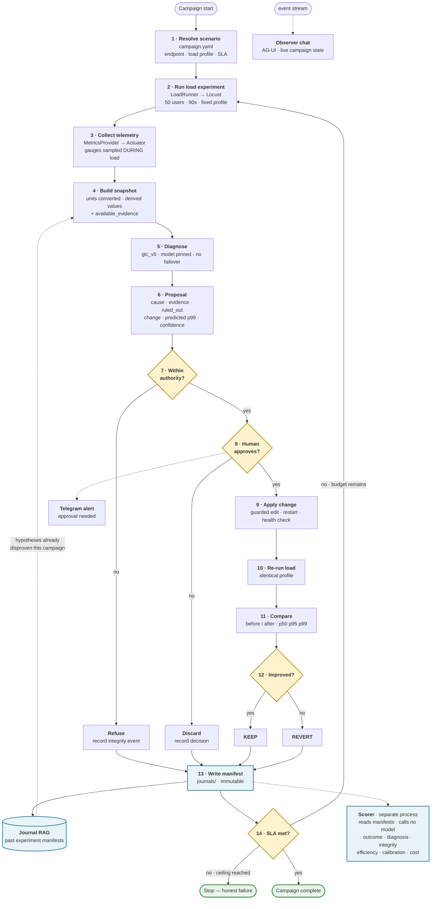
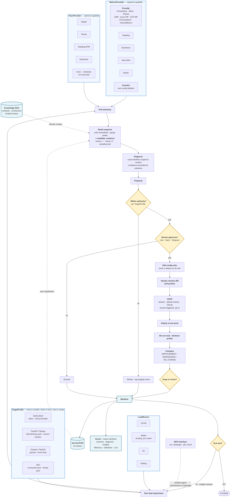

# Crucible — Flow Diagrams

Two diagrams. **Capstone** is what ships in four weeks. **Product** is the same
loop with every fixed component replaced by an adapter.

Show them in this order. The capstone diagram answers "is this four weeks or four
months"; the product diagram answers "where does this go." Reversing them makes
the scope question harder to answer.

Both render in GitHub, VS Code with the Mermaid extension, and mermaid.live for
PNG/SVG export.

---

## Diagram 1 — Capstone (four weeks)



### What each guard is for

| Step | Purpose |
|---|---|
| 7 — Authority | Six allowed properties. The load profile and SLA definition are protected. An agent that can edit its own SLA always passes. |
| 8 — Human | Blocks. Nothing is applied without a human decision. |
| 12 — Verdict | Measured, not predicted. This is what makes an outcome *verified*. |
| 14 — SLA | Bounded by an experiment ceiling and a budget. Running out is an honest failure, not a crash. |

### The two arrows that matter most

**Journal RAG → step 4.** Prior manifests enter the snapshot, so the agent does
not re-propose a hypothesis it already disproved. Reasoning is cumulative across
experiments rather than starting fresh each round.

**Step 13 → step 14 → step 2.** The loop closes on measured evidence. Without
this, every proposal is an unverified pass.

---

## Diagram 2 — Product

Same loop. Every fixed component becomes an adapter.



### The design guarantee for approvers

The agent never has write access to a deployment pipeline and never triggers a
deploy on its own. Unattended, it can do exactly three things: run load, read
telemetry, and write a proposal. Every step after the human-approval gate requires
a person.

### Why PromQL is one adapter, not eight

Prometheus, Mimir, Thanos, VictoriaMetrics, Chronosphere, AWS Managed Prometheus,
Azure Managed Prometheus and Google Managed Prometheus all answer PromQL. One
implementation covers all of them.

Datadog, Dynatrace, New Relic and Elastic each have proprietary query languages
and need their own adapter. That is the market shape, not a design choice.

### Capabilities are declared, never assumed

`available_evidence` travels with every snapshot:

```json
{
  "metrics": true,
  "traces": false,
  "trace_reason": "ActuatorMetricsProvider has no trace store",
  "trace_sampling_rate": null,
  "endpoint_breakdown": true
}
```

Without this the agent cannot distinguish *"I looked and found no slow spans"*
from *"I never looked at spans"* — and will eliminate a live hypothesis on
evidence it never gathered. That is the same failure as the spike's K3 attempt 1:
`pending: 0` did not mean the pool was healthy, it meant the gauge was read after
the load drained.

Where traces exist, sampling rate matters too. Most production tracing runs at
1–10% head sampling, and a p99 outlier is by definition rare — so "no slow spans"
can be misleading even on a fully instrumented deployment.

---

## Rendering for slides

1. Paste a block into <https://mermaid.live>
2. Export SVG for slides, PNG for documents
3. For a five-minute pitch, Diagram 1 is the one on screen. Diagram 2 belongs on
   the roadmap slide, or in the appendix if questions go there.

Diagram 2 is dense on purpose — it is a document diagram, not a slide. If it must
go on a slide, split it: adapters on one, loop on another.
